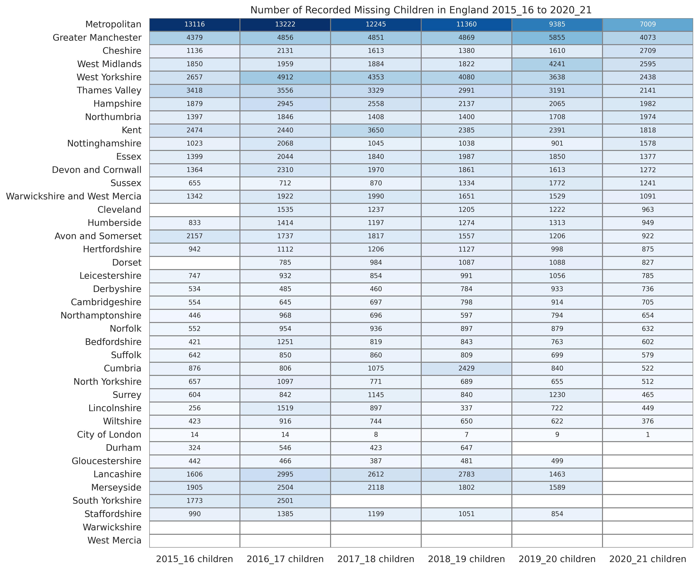

# missing_children_england_2020_21_visualisations
Data visualisations of the NCA stats for missing children in England 2020 to 2021

## Licence
Creative Commons Attribution. Feel free to share, copy, and build on this code and data as long as you cite this source. 

## Programming Language

Python

## Code Files and Data Flow

There are 2 Google Colab notebooks (and equivalent .py files) - one for the data preparation and one for the visualisations:
- **Missing_Children_England_2020_2021_DATA_PREP.ipynb** (missing_children_england_2020_2021_data_prep.py)
  - Inputs (see colab file for data source details):
    - table_a3.csv ([NCA data](https://missingpersons.police.uk/cy-gb/resources/downloads/missing-persons-statistical-bulletins) - number of **missing children** and missing child incidents across several years)
    - table_b1.csv ([NCA data](https://missingpersons.police.uk/cy-gb/resources/downloads/missing-persons-statistical-bulletins) - area **population** per police force, calls recorded and rate per 1000)
    - table_c2.csv ([NCA data](https://missingpersons.police.uk/cy-gb/resources/downloads/missing-persons-statistical-bulletins) - **age group** percentage distribution)
    - table_f1.csv ([NCA data](https://missingpersons.police.uk/cy-gb/resources/downloads/missing-persons-statistical-bulletins) - stats for children **in care** and children not in care)
    - child_residential_care _31_mar_2021.csv ([Ofsted data](https://www.gov.uk/government/statistics/childrens-social-care-data-in-england-2021) - **children's homes** per area)
    - la_to_pf_areas.csv ([ONS data](https://www.data.gov.uk/dataset/d014d7d2-1836-468f-97b8-bb7d0b061bf7/local-authority-district-to-community-safety-partnerships-to-police-force-areas-december-2016-lookup-in-england-and-wales) - **local authority mapping** to police force)
  - Outputs:
    - all_force_data.csv (row per police force with various missing children stats in columns)
    - childrens_homes_mapped_to_forces.csv (row per children's home details mapped to police force)
- **Missing_Children_England_2020_2021_VISUALISATIONS.ipynb** (missing_children_england_2020_2021_visualisations.py)
  - Inputs:
    - all_force_data.csv (row per police force with various **missing children** stats in columns)
    - childrens_homes_mapped_to_forces.csv (row per children's home details mapped to police force)
  - Outputs:
    - care_summary.csv
    - Recorded Missing Children in England 2015_16 to 2020_21.png
    - Number of Children Recorded Missing.png
    - Change Since Previous Year.png
    - Age group distribution.png
    - Number childrens home places.png
    - Childrens home sector distribution.png
    - Private childrens home providers.png
    - Care Summary Heatmaps.png
    
## Visualisations

